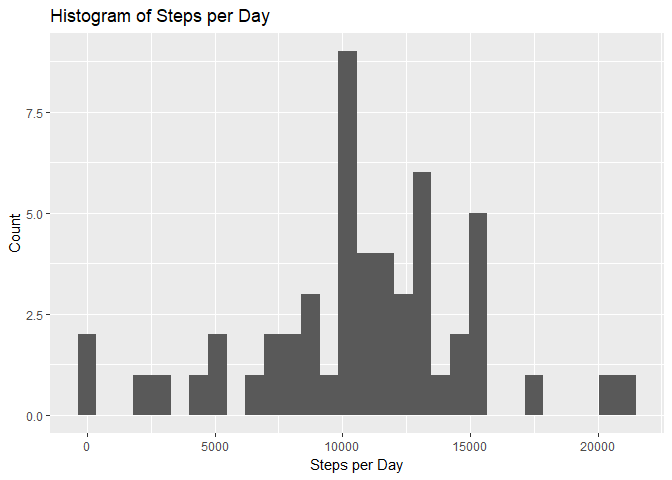
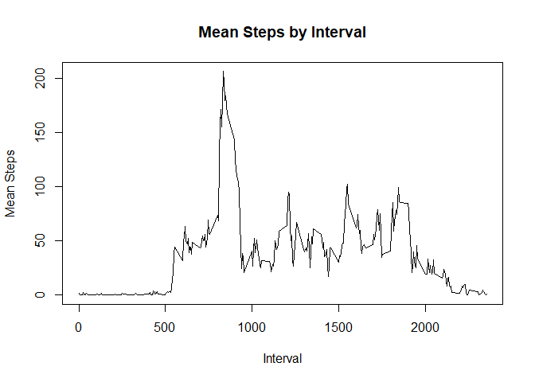
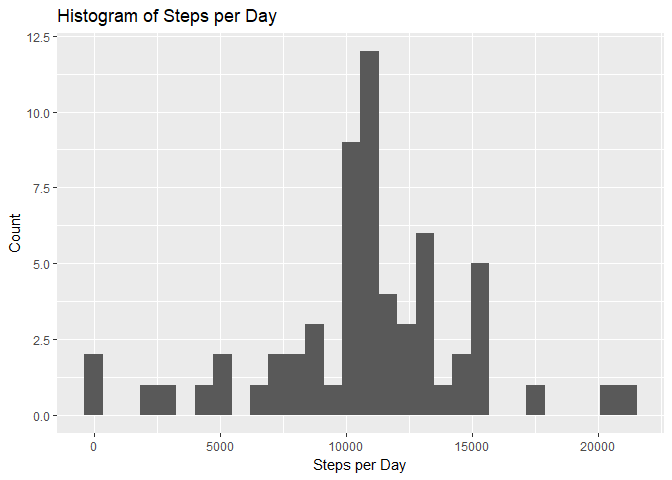
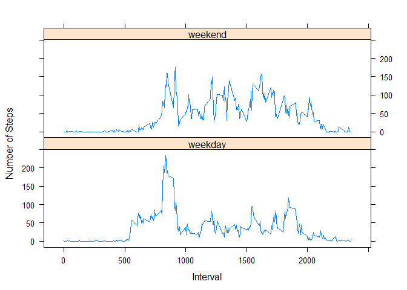

# Reproducible Research: Peer Assessment 1

# Loading and preprocessing the data
## Code for reading in the dataset and/or processing the data


```r
# Turn off scientific notation
options(scipen=999)

# Get the data
activity <- read.csv("activity.csv", stringsAsFactors = FALSE)
```

# What is mean total number of steps taken per day?

## Histogram of the total number of steps taken each day


```r
# For this part of the assignment, you can ignore the missing values in the dataset.
# Calculate the total number of steps taken per day
library(dplyr)
```

```
## 
## Attaching package: 'dplyr'
```

```
## The following objects are masked from 'package:stats':
## 
##     filter, lag
```

```
## The following objects are masked from 'package:base':
## 
##     intersect, setdiff, setequal, union
```

```r
agg_date <- activity %>%
  filter(!is.na(steps)) %>%
  group_by(date) %>%
  summarize(steps_per_day = sum(steps, na.rm = TRUE))

# Create plot
library(ggplot2)
ggplot(agg_date, aes(steps_per_day)) +
  geom_histogram() +
  labs(title = "Histogram of Steps per Day", 
       y = "Count",
       x = "Steps per Day")
```

```
## `stat_bin()` using `bins = 30`. Pick better value with `binwidth`.
```

<!-- -->

## Mean and median number of steps taken each day


```r
mean_steps_per_day <- round(mean(agg_date$steps_per_day), 1)
```

The mean number of steps per day is 10766.2.


```r
median_steps_per_day <- round(median(agg_date$steps_per_day), 1)
```

The median number of steps per day is 10765.

# What is the average daily activity pattern?

## Time series plot of the average number of steps taken

```r
# Calculate mean number of steps per interval
agg_interval <- activity %>%
  filter(!is.na(steps)) %>%
  group_by(interval) %>%
  summarize(mean_steps = mean(steps, na.rm = TRUE))

# Create plot
plot(agg_interval$mean_steps ~ agg_interval$interval,
     type = "l",
     main = "Mean Steps by Interval",
     xlab = "Interval",
     ylab = "Mean Steps")
```

<!-- -->

## The 5-minute interval that, on average, contains the maximum number of steps


```r
temp <- subset(agg_interval, mean_steps == max(agg_interval$mean_steps))
```

The 5-minute interval that, on average, contains the maximum number of steps is interval number 835.

# Imputing missing values

## Calculate and report the total number of missing values in the dataset (i.e. the total number of rows with NAs)


```r
temp <- nrow(activity[is.na(activity$steps),])
```

The total number of rows with a missing value for steps is 2304.

## Devise a strategy for filling in all of the missing values in the dataset. The strategy does not need to be sophisticated. For example, you could use the mean/median for that day, or the mean for that 5-minute interval, etc.
## Create a new dataset that is equal to the original dataset but with the missing data filled in.

```r
# Join mean steps by interval data to activity data
activity_imputed <- activity
activity_imputed <- merge(activity_imputed, agg_interval, by = "interval")

# Replace missing value with mean steps
activity_imputed$steps[is.na(activity_imputed$steps)] <- round(activity_imputed$mean_steps[is.na(activity_imputed$steps)], 0)
activity_imputed$mean_steps <- NULL
```

Make a histogram of the total number of steps taken each day and Calculate and report the mean and median total number of steps taken per day. Do these values differ from the estimates from the first part of the assignment? What is the impact of imputing missing data on the estimates of the total daily number of steps?


```r
# For this part of the assignment, you can ignore the missing values in the dataset.
# Calculate the total number of steps taken per day
agg_date_imputed <- activity_imputed %>%
  filter(!is.na(steps)) %>%
  group_by(date) %>%
  summarize(steps_per_day = sum(steps, na.rm = TRUE))

# Create plot
ggplot(agg_date_imputed, aes(steps_per_day)) +
  geom_histogram() +
  labs(title = "Histogram of Steps per Day", 
       y = "Count",
       x = "Steps per Day")
```

```
## `stat_bin()` using `bins = 30`. Pick better value with `binwidth`.
```

<!-- -->

## Mean and median number of steps taken each day


```r
mean_steps_per_day_imputed <- round(mean(agg_date_imputed$steps_per_day), 1)
```

The mean number of steps per day is 10765.6.


```r
median_steps_per_day_imputed <- round(median(agg_date_imputed$steps_per_day), 1)
```

The median number of steps per day is 10762.

Yes, after imputing missing data the mean and median number of steps per day are slightly different from before the missing data was imputed. The mean steps before imputation was 10766.2 but after imputation it is 10765.6. Similarly, the median steps before imputation was 10765 but after imputation it is 10762. There is only a small impact from imputing the missing data.

# Are there differences in activity patterns between weekdays and weekends?

## Create a new factor variable in the dataset with two levels – “weekday” and “weekend” indicating whether a given date is a weekday or weekend day.


```r
# Format data
activity$weekday <- weekdays(as.Date(activity$date, "%Y-%m-%d"))
activity$weekend <- "weekday"
activity$weekend[activity$weekday == "Saturday" |
                   activity$weekday == "Sunday"] <- "weekend"
activity$weekend <- as.factor(activity$weekend)
```

## Panel plot comparing the average number of steps taken per 5-minute interval across weekdays and weekends


```r
# Calculate mean number of steps per interval
agg_interval <- activity %>%
  filter(!is.na(steps)) %>%
  group_by(interval, weekend) %>%
  summarize(mean_steps = mean(steps, na.rm = TRUE))

library(lattice)
xyplot(agg_interval$mean_steps ~ agg_interval$interval | agg_interval$weekend,
       xlab = 'Interval',
       ylab = 'Number of Steps',
       layout = c(1, 2),
       type = "l")
```

<!-- -->
